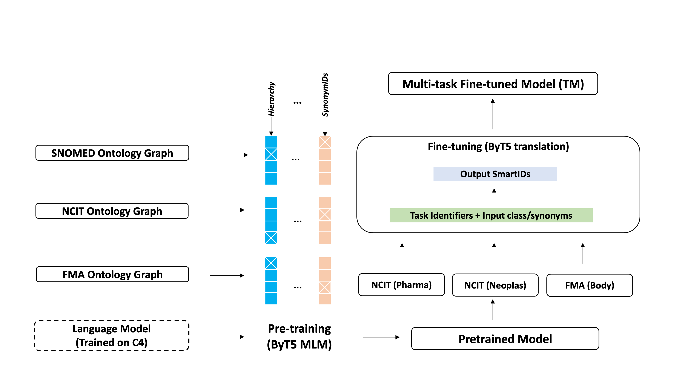

[](https://creativecommons.org/licenses/by-nc-sa/4.0/)

#### Updates:
 - [8/17] We added two `.sh` files to self-contain the training and pre-training hyperparameters. The Readme walk-through is also updated to reflect this. 
 
## Ontology Matching (OM) / Ontology Alignment (OA)

<p align="center">
 
</p>


Unsupervised Ontology Matching (OM) or Ontology Alignment (OA) is performed by treating it as a translation task. This framework leverages a multi-task sequence-to-sequence transformer model to perform alignment across multiple ontologies in a zero-shot, unified and end-to-end manner. More specifically, following steps are performed :

(1) Training data generation : For the given source and target ontologies, pre-training and fine-tuning data is generated.

(2) Pre-training : Starting from a language model pre-trained on the C4 dataset, the model is further pre-trained on the full ontologies, learning each ontology’s semantics and hierarchical structure.

(3) Fine-tuning : Afterward, the model is trained on the downstream task using the subset on- tology data during the fine-tuning stage.

(4) Predictions : In the prediction step, given a source ontology, the output is predicted in a zero-shot manner.

For the OAEI 2022::BioML track, evaluation can be performed by downloading the trained model and data.


## Packages

it is recommend to install the following packages using `apt` or `brew` depending on OS.


(ubuntu) `sudo apt-get install cmake build-essential pkg-config libgoogle-perftools-dev gperftools`

(mac os) `brew install cmake gperftools xorgproto openjdk`


## Create Env

`python ==3.8.10`

```
sh prepare_env.sh
```

## Run evaluation based on trained model and pre-generated embeddings

### Download Model Checkpoint and Embedding

#### The following will download pre-trained, fine-tuned checkpoint, as well as pre-computed embeddings for entire 3 tasks. (estimated size ~30GB)

```
# Make sure you have git-lfs installed (https://git-lfs.com)
git lfs install
git clone https://huggingface.co/sadra/ontology-matching-models models
```

### Run evaluation on pre-generated embeddings/predictions and get metrics do the following: (requires generated predictions)

Note: to run this one need to first generate training data (described in the next section), as meta data including eval sets are required for this step.
Note: make sure to run python command inside the envoronemnt, activate with: `source .venv/bin/activate`

#### Get score_based metrics

After downloading the trained model, embeddings, and generating training data, run the following commands tp get score based metrics

```python
cd scripts 
python eval_scripts.py --task_name [body] --score_based --prediction_path [path to .pkl and .json files of results]
```

add or substitute --embeddding_based --get_hit_mrr for other metrics

```
--score_based #including this will run evaluation used confidence scores on prediction
--embedding_based #including this will using embedding similarities
--get_hit_mrr #including this will provide hit and mrr
```

example:

```
python eval_scripts.py --task_name body --score_based --prediction_path  ../models/results-07-22-23-checkpoint-60000
```

## Perform OA on given ontologies from scratch

## Generate training data

### How to use:

1. [manual] Download the following from sources, and put the under `data/source_data`

   [SNOMED_CT US Septemeber 2021](https://download.nlm.nih.gov/mlb/utsauth/USExt/SnomedCT_USEditionRF2_PRODUCTION_20210901T120000Z.zip)

   [SNOMED_CT US Septemeber 2016](https://download.nlm.nih.gov/mlb/utsauth/USExt/SnomedCT_RF2Release_US1000124_20160901.zip)
2. Run the following to generate the data.

   This would download UMLS data from OM Bio-ML track 2022. This would also generate metadata related to pretraining and fine-tune data under `data/` as well as other data required for prediction.

   ```
   cd scripts
   sh source_data.sh
   ```

## Pre-training

Pretraining is done starting from byt5-small google checkpoint and using the generated pre-training data

- Set the file path inside regarding base model and pre-training data in the `pre-train.sh`
- set mlm to True, start from byt5 google checkpoint.
- Run the following commands to perform pre-training:(the first arg is the # of GPUs as is assumed to be 8)

  ```
  cd scripts
  sh pretrain.sh 8 
  ```

  The script will perform pre-training and will generate pre-trained checkpoints.

### Pre-Training Tasks:

We Use the Following Mappings for prefixing:

Ontology-ids = {"SNOMED": "0","FMA": "1","NCIT": "2"}
Definition-mappings = {"FSN": "F","SYN": "S","DEF": "D"}
For Example,

- Fully-Specified-Name in the NCIT ontology is Prefixed as “F2:”,
- the Tree-Ids for SNOMED start with 0-

#### Some examples of tasks icnluded in pre-training

1. Tree Learning:

   - Child to Parents (The ones that do not share same code)
     CP: 0-2-3-1-43-1 0-2-3-42-1
   - Synonyms:
     0-2-3-1-43-1 0-2-3-42-1-0
2. ID definition learning:

   - Tree-ID to Def , SYN, FSN:
     ```
     A) 0-9-18-6-10-28-2 F0: Coagulation or electrocoagulation of inner ear
     B) D1: Covid19 1-20-12-3-4
     ```
3. Def to Def understanding:

   - SYN FSN, DEF to each other:
     ```
     A) F0: Coagulation or electrocoagulation of inner ear S0: electrocoagulation of ear
     B) F2: Angioimmunoblastic T-Cell Lymphoma S2: AILT
     ```

## Fine-tuning

Fine-tuning is done based on generated files for fine-tuning as well as pre-trained checkpoint:

- Set the model_path_name to `checkpoint-55000` in `train.sh``, and update the path to fine-tuining subset,
- Set mlm to `False`
- Run the following commands to perform fine-tuning: (the argument is the # of GPUs as is assumed to be 8)

  ```
  cd scripts
  sh train.sh 8
  ```

### Fine-tuning tasks:

The data that was used for finetuning was also from same ontology. It was subset of the data that is used for the OM problem. The dataset tries to map from FMA/NCIT Def and Synonyms to its Hierarchical-IDs. (we also extracted some more by exact match between FMA and NCIT concepts with SNOMED). We finetuned the data with prefix same as the evaluation data (from SNOMED to FMA/NCIT), so we used F0 as prompt for all input, and we used 1- as suffix (prompt) for the FMA dataset, and 2- for the NCIT:

- **We only used F0 for both Syn and FSN of the input ontology**
- **We Also only used 1- and 2- as prompt of prediction as we only predicted Hierarchical-ID of FMA and NCIT.**

```
- For FMA, predicting Hierarchical-ID

    Input: "F0: Structure of Couinaud hepatic segment III 1-"
    Output: "2-3-4-6-87"

- For NCIT, predicting Hierarchical-ID

    Input: "F0: Rectal polyp 2-"
    Output: "2-3-0-0-1"
```
## Predictions - Generate model predictions and embeddings:

Following script is for embedding extraction: (reqiures a fine-tuned checkpoint)

```
cd scripts
python embedding_generation_gpu.py --task_name [task name either body,phar,neop ] --gpu_num [can be 0 or any number]  --checkpoint_path [path to fine-tuned checkpoint filder (.bin)] --temp_scale [either 1.0 or above)

```
Example for generating embedding for target ontology and task of phar on gpu 1 with temp scaling of 3.0 on checkpoint-60000

```
python embedding_generation_gpu.py --task_name phar --gpu_num 1 --is_target  --checkpoint_path [path to fine-tuned checkpoint filder (.bin)] --temp_scale 3.0
```
same thing should be done for source ontology as we need embedding for both source and target:

```
python embedding_generation_gpu.py --task_name phar --gpu_num 1  --checkpoint_path [path to fine-tuned checkpoint filder (.bin)] --temp_scale 3.0
```
Based on the generated embeddings and fine-tuned model, evaluation can be performed as mentioned in the start of this ReamdMe

## Contributions 

- Mariyam Amir
- Mahsa Eslamialishah
- Murchana Baruah
- Ehsan Ehsani
- Alireza Bahramali
- Sadra Naddaf-sh
- Saman Zarandioon

## LICENSE

The content of this repository is protected under [](https://creativecommons.org/licenses/by-nc-sa/4.0/).
